# GazTask

GazTask - система, позволяющая осуществлять контроль над работой теплиц. Содержит в себе средства мониторинга, управления, и валидации.


# Content

## Startup 

Обратите внимание, что данный сервис имеет зависимость от [GreenhouseService](./greenhouse_emulator) и [AssessmentService](./assessment_emulator). Для корректной работы необходимо развернуть их и следовать инструкциями по конфигурации.
(!) Для тестирования наполните базу данных [тестовыми данными](./db_snapshots).

## Demonstration 

Для удобства пользователей представлены первичные тест-кейсы. Обратите внимание, что представленную последовательность действий Вы сможете реализовать самостоятельно, использовав инструкции для развертывания системы.
В то же время для достоверности обращайте внимание на даты, указанные в логах и БД. 

### Получение статистики по теплицам и регионам с возможностью фильтрации перечней как по состоянию, так и по регионам. 

Очевидно, этап получения статистики состоит из двух частей: 

1) Получение информации о существующих фильтрах: 

**Screenshots**:

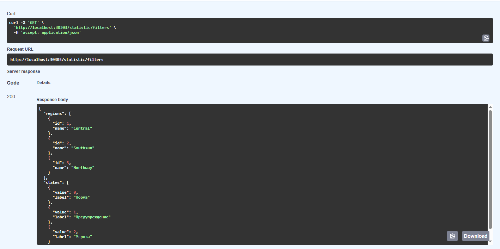

**Logs**:

```text
[06/Nov/2025:18:24:38.057 +0300] [request_logging.py:72       ] [DEBUG   ] [                                    ] "Request is received." RequestFromClient(method='GET', endpoint='http://localhost:30303/statistic/filters', headers='{"host": "localhost:30303", "connection": "keep-alive", "authorization": "Basic SXZhbjoxMjM0", "sec-ch-ua-platform": "\\"Windows\\"", "user-agent": "Mozilla/5.0 (Windows NT 10.0; Win64; x64) AppleWebKit/537.36 (KHTML, like Gecko) Chrome/141.0.0.0 Safari/537.36", "accept": "application/json", "sec-ch-ua": "\\"Google Chrome\\";v=\\"141\\", \\"Not?A_Brand\\";v=\\"8\\", \\"Chromium\\";v=\\"141\\"", "sec-ch-ua-mobile": "?0", "sec-fetch-site": "same-origin", "sec-fetch-mode": "cors", "sec-fetch-dest": "empty", "referer": "http://localhost:30303/docs", "accept-encoding": "gzip, deflate, br, zstd", "accept-language": "ru-RU,ru;q=0.9,en-US;q=0.8,en;q=0.7", "cookie": "SESSION=05cca311-e5d8-456b-bece-18d17d764d29"}', body='', client_ip='127.0.0.1')
[06/Nov/2025:18:24:38.062 +0300] [app.py:29                   ] [DEBUG   ] [4c9803ca-f76b-44a9-b143-fc23d7b729d3] "Loaded 3 regions and 3 states for filters" 
[06/Nov/2025:18:24:38.062 +0300] [request_logging.py:46       ] [DEBUG   ] [4c9803ca-f76b-44a9-b143-fc23d7b729d3] "Request is processed." ResponseToClient(status=200, headers='{"content-length": "223", "content-type": "application/json", "x-request-id": "4c9803ca-f76b-44a9-b143-fc23d7b729d3"}', body='')
```


2) Получение статистики с помощью заданных фильтров: 

**Screenshots**:

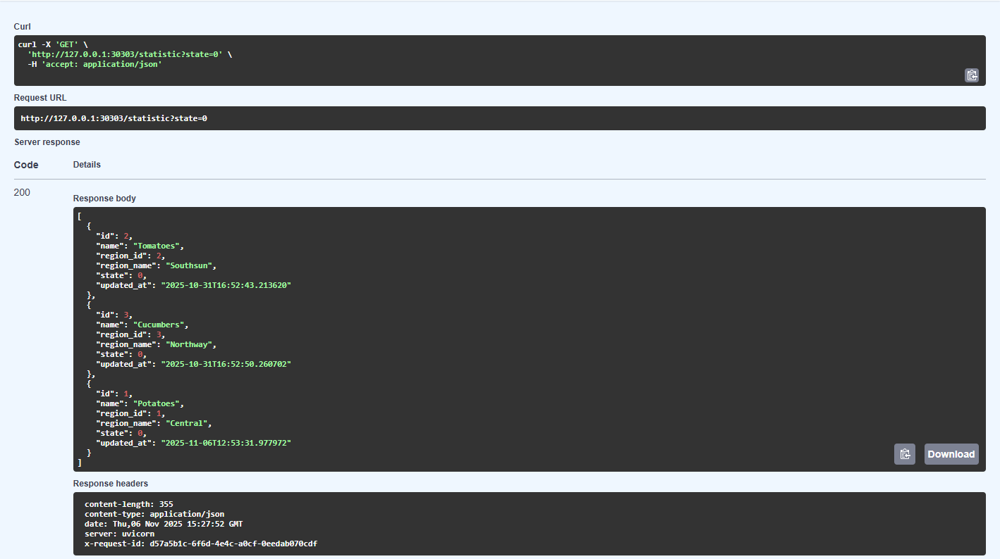

**Logs**:

```text
[06/Nov/2025:18:43:37.900 +0300] [request_logging.py:72       ] [DEBUG   ] [                                    ] "Request is received." RequestFromClient(method='GET', endpoint='http://127.0.0.1:30303/statistic?state=0', headers='{"host": "127.0.0.1:30303", "connection": "keep-alive", "authorization": "Basic SXZhbjoxMjM0", "sec-ch-ua-platform": "\\"Windows\\"", "user-agent": "Mozilla/5.0 (Windows NT 10.0; Win64; x64) AppleWebKit/537.36 (KHTML, like Gecko) Chrome/141.0.0.0 Safari/537.36", "accept": "application/json", "sec-ch-ua": "\\"Google Chrome\\";v=\\"141\\", \\"Not?A_Brand\\";v=\\"8\\", \\"Chromium\\";v=\\"141\\"", "sec-ch-ua-mobile": "?0", "sec-fetch-site": "same-origin", "sec-fetch-mode": "cors", "sec-fetch-dest": "empty", "referer": "http://127.0.0.1:30303/docs", "accept-encoding": "gzip, deflate, br, zstd", "accept-language": "ru-RU,ru;q=0.9,en-US;q=0.8,en;q=0.7"}', body='', client_ip='127.0.0.1')
[06/Nov/2025:18:43:37.912 +0300] [app.py:66                   ] [DEBUG   ] [f035970c-8df3-4b39-9ccc-7944b909de50] "Loaded 3 greenhouses (region_id=None, state=0)" 
[06/Nov/2025:18:43:37.913 +0300] [request_logging.py:46       ] [DEBUG   ] [f035970c-8df3-4b39-9ccc-7944b909de50] "Request is processed." ResponseToClient(status=200, headers='{"content-length": "355", "content-type": "application/json", "x-request-id": "f035970c-8df3-4b39-9ccc-7944b909de50"}', body='')
```


### Предоставление истории изменений статусов каждой отдельной таблицы: 

**Screenshots**:

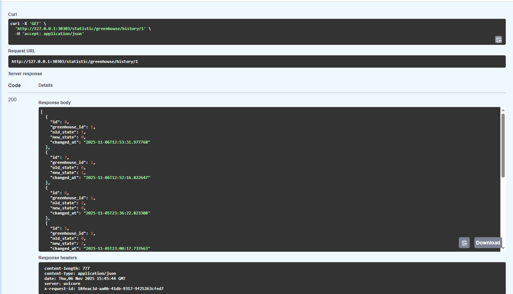

**Logse**:

```text
[06/Nov/2025:18:45:44.933 +0300] [request_logging.py:72       ] [DEBUG   ] [                                    ] "Request is received." RequestFromClient(method='GET', endpoint='http://127.0.0.1:30303/statistic/greenhouse/history/1', headers='{"host": "127.0.0.1:30303", "connection": "keep-alive", "authorization": "Basic SXZhbjoxMjM0", "sec-ch-ua-platform": "\\"Windows\\"", "user-agent": "Mozilla/5.0 (Windows NT 10.0; Win64; x64) AppleWebKit/537.36 (KHTML, like Gecko) Chrome/141.0.0.0 Safari/537.36", "accept": "application/json", "sec-ch-ua": "\\"Google Chrome\\";v=\\"141\\", \\"Not?A_Brand\\";v=\\"8\\", \\"Chromium\\";v=\\"141\\"", "sec-ch-ua-mobile": "?0", "sec-fetch-site": "same-origin", "sec-fetch-mode": "cors", "sec-fetch-dest": "empty", "referer": "http://127.0.0.1:30303/docs", "accept-encoding": "gzip, deflate, br, zstd", "accept-language": "ru-RU,ru;q=0.9,en-US;q=0.8,en;q=0.7"}', body='', client_ip='127.0.0.1')
[06/Nov/2025:18:45:44.940 +0300] [request_logging.py:46       ] [DEBUG   ] [184eac3d-aa0b-41db-9317-9f25263cfed7] "Request is processed." ResponseToClient(status=200, headers='{"content-length": "777", "content-type": "application/json", "x-request-id": "184eac3d-aa0b-41db-9317-9f25263cfed7"}', body='')
```

### Корректное отображение обновления данных по теплицам, сохранение их в БД.

При старте сервиса "control" создаются 2 асинхронных задачи: веб-сервер и крутящийся демон. В крутящемся демоне [можно задавать интервалы обновления представленных данных](./control/src/managers/updater/app.py).
Дальнейшние примеры представлены при первичном запуске приложения, однако корректность повторных действий гарантируется разработчиком.

1) Запланированное обновление измерений. 

**Logs**:
```text
[06/Nov/2025:19:09:56.535 +0300] [app.py:32                   ] [INFO    ] [                                    ] "Starting polling daemon (metering=1500s, status=900s)" 
[06/Nov/2025:19:09:56.535 +0300] [app.py:55                   ] [DEBUG   ] [                                    ] "Starting new metering polling iteration..." 
[06/Nov/2025:19:09:56.541 +0300] [app.py:137                  ] [DEBUG   ] [                                    ] "Starting new status update iteration..." 
[06/Nov/2025:19:09:56.624 +0300] [app.py:41                   ] [DEBUG   ] [                                    ] "Getting temperature metering." 
[06/Nov/2025:19:09:56.929 +0300] [app.py:25                   ] [DEBUG   ] [                                    ] "Started getting greenhouse state info." 
[06/Nov/2025:19:09:57.236 +0300] [app.py:59                   ] [DEBUG   ] [                                    ] "Getting humidity metering." 
[06/Nov/2025:19:09:57.752 +0300] [app.py:77                   ] [DEBUG   ] [                                    ] "Getting PH metering." 
[06/Nov/2025:19:09:58.279 +0300] [app.py:120                  ] [DEBUG   ] [                                    ] "No new 'temperature' meterings found." 
[06/Nov/2025:19:09:58.279 +0300] [app.py:120                  ] [DEBUG   ] [                                    ] "No new 'humidity' meterings found." 
[06/Nov/2025:19:09:58.280 +0300] [app.py:120                  ] [DEBUG   ] [                                    ] "No new 'ph' meterings found." 
```

2) Запланированное обновлений измерений с присутствием нового значения. 

Новые значения в хранилище GreenhouseEmulator (1-3):
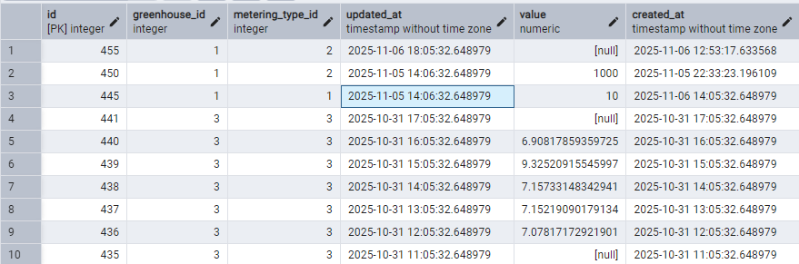

**Logs**:
```text
[06/Nov/2025:19:17:11.619 +0300] [app.py:32                   ] [INFO    ] [                                    ] "Starting polling daemon (metering=1500s, status=900s)" 
[06/Nov/2025:19:17:11.619 +0300] [app.py:55                   ] [DEBUG   ] [                                    ] "Starting new metering polling iteration..." 
[06/Nov/2025:19:17:11.624 +0300] [app.py:137                  ] [DEBUG   ] [                                    ] "Starting new status update iteration..." 
[06/Nov/2025:19:17:11.698 +0300] [app.py:41                   ] [DEBUG   ] [                                    ] "Getting temperature metering." 
[06/Nov/2025:19:17:12.002 +0300] [app.py:25                   ] [DEBUG   ] [                                    ] "Started getting greenhouse state info." 
[06/Nov/2025:19:17:12.249 +0300] [app.py:310                  ] [INFO    ] [                                    ] "Greenhouse 1 at 2025-11-06T14:06:32.648979: detected outlier 10.0 (deviation 0.558 > 0.1) — replaced with last known 22.632801902900074" 
[06/Nov/2025:19:17:12.250 +0300] [app.py:59                   ] [DEBUG   ] [                                    ] "Getting humidity metering." 
[06/Nov/2025:19:17:12.756 +0300] [app.py:310                  ] [INFO    ] [                                    ] "Greenhouse 1 at 2025-11-06T14:06:32.648979: detected outlier 1000.0 (deviation 16.141 > 0.1) — replaced with last known 58.341262863363035" 
[06/Nov/2025:19:17:12.756 +0300] [app.py:300                  ] [INFO    ] [                                    ] "Greenhouse 1 at 2025-11-06T18:05:32.648979: missing value replaced with last known 58.341" 
[06/Nov/2025:19:17:12.756 +0300] [app.py:77                   ] [DEBUG   ] [                                    ] "Getting PH metering." 
[06/Nov/2025:19:17:13.267 +0300] [app.py:118                  ] [INFO    ] [                                    ] "Saved 1 new 'temperature' meterings." 
[06/Nov/2025:19:17:13.272 +0300] [app.py:118                  ] [INFO    ] [                                    ] "Saved 2 new 'humidity' meterings." 
[06/Nov/2025:19:17:13.273 +0300] [app.py:120                  ] [DEBUG   ] [                                    ] "No new 'ph' meterings found." 
```

Значения после обработки сервисом `Control` в хранилище Control:

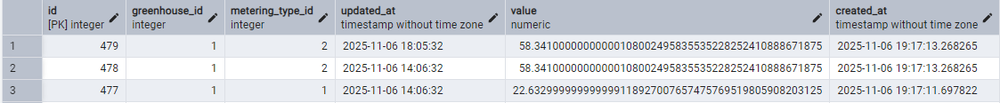

3) Запланированное обновление статусов теплиц. 

Старое хранилище сервиса `Control`:

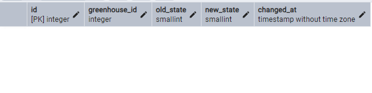

**Logs**:
```text
[06/Nov/2025:19:31:19.158 +0300] [app.py:137                  ] [DEBUG   ] [                                    ] "Starting new status update iteration..." 
[06/Nov/2025:19:31:19.237 +0300] [app.py:41                   ] [DEBUG   ] [                                    ] "Getting temperature metering." 
[06/Nov/2025:19:31:19.532 +0300] [app.py:25                   ] [DEBUG   ] [                                    ] "Started getting greenhouse state info." 
[06/Nov/2025:19:31:19.797 +0300] [app.py:310                  ] [INFO    ] [                                    ] "Greenhouse 1 at 2025-11-06T14:06:32.648979: detected outlier 10.0 (deviation 0.558 > 0.1) — replaced with last known 22.63280640510689" 
[06/Nov/2025:19:31:19.798 +0300] [app.py:59                   ] [DEBUG   ] [                                    ] "Getting humidity metering." 
[06/Nov/2025:19:31:20.302 +0300] [app.py:310                  ] [INFO    ] [                                    ] "Greenhouse 1 at 2025-11-06T14:06:32.648979: detected outlier 1000.0 (deviation 16.141 > 0.1) — replaced with last known 58.341251677688014" 
[06/Nov/2025:19:31:20.302 +0300] [app.py:300                  ] [INFO    ] [                                    ] "Greenhouse 1 at 2025-11-06T18:05:32.648979: missing value replaced with last known 58.341" 
[06/Nov/2025:19:31:20.303 +0300] [app.py:77                   ] [DEBUG   ] [                                    ] "Getting PH metering." 
[06/Nov/2025:19:31:20.811 +0300] [app.py:120                  ] [DEBUG   ] [                                    ] "No new 'temperature' meterings found." 
[06/Nov/2025:19:31:20.813 +0300] [app.py:120                  ] [DEBUG   ] [                                    ] "No new 'humidity' meterings found." 
[06/Nov/2025:19:31:20.813 +0300] [app.py:120                  ] [DEBUG   ] [                                    ] "No new 'ph' meterings found." 
[06/Nov/2025:19:31:30.057 +0300] [app.py:208                  ] [DEBUG   ] [                                    ] "Greenhouse 2: state unchanged (0)" 
[06/Nov/2025:19:31:30.058 +0300] [app.py:25                   ] [DEBUG   ] [                                    ] "Started getting greenhouse state info." 
[06/Nov/2025:19:31:40.571 +0300] [app.py:225                  ] [INFO    ] [                                    ] "Greenhouse 3: state changed 0 → 1" 
[06/Nov/2025:19:31:40.577 +0300] [app.py:25                   ] [DEBUG   ] [                                    ] "Started getting greenhouse state info." 
[06/Nov/2025:19:31:51.105 +0300] [app.py:225                  ] [INFO    ] [                                    ] "Greenhouse 1: state changed 0 → 1" 
```

Новое хранилище Сервиса `Control`:
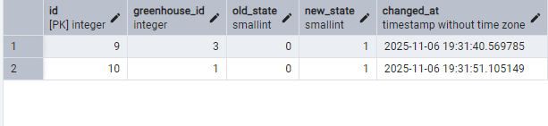

4) Принудительное обновление данных

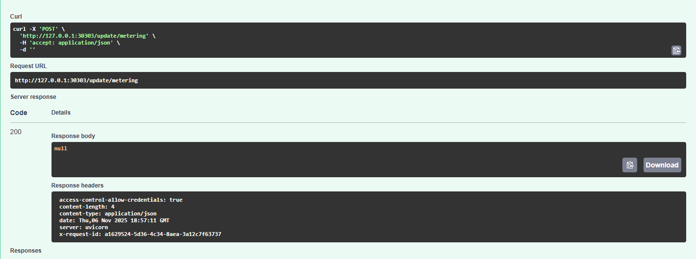

**Logs**
```text
[06/Nov/2025:21:57:11.288 +0300] [request_logging.py:72       ] [DEBUG   ] [                                    ] "Request is received." RequestFromClient(method='POST', endpoint='http://127.0.0.1:30303/update/metering', headers='{"host": "127.0.0.1:30303", "connection": "keep-alive", "content-length": "0", "authorization": "Basic SXZhbjoxMjM0", "sec-ch-ua-platform": "\\"Windows\\"", "user-agent": "Mozilla/5.0 (Windows NT 10.0; Win64; x64) AppleWebKit/537.36 (KHTML, like Gecko) Chrome/141.0.0.0 Safari/537.36", "accept": "application/json", "sec-ch-ua": "\\"Google Chrome\\";v=\\"141\\", \\"Not?A_Brand\\";v=\\"8\\", \\"Chromium\\";v=\\"141\\"", "sec-ch-ua-mobile": "?0", "origin": "http://127.0.0.1:30303", "sec-fetch-site": "same-origin", "sec-fetch-mode": "cors", "sec-fetch-dest": "empty", "referer": "http://127.0.0.1:30303/docs", "accept-encoding": "gzip, deflate, br, zstd", "accept-language": "ru-RU,ru;q=0.9,en-US;q=0.8,en;q=0.7"}', body='', client_ip='127.0.0.1')
[06/Nov/2025:21:57:11.293 +0300] [app.py:55                   ] [DEBUG   ] [a1629524-5d36-4c34-8aea-3a12c7f63737] "Starting new metering polling iteration..." 
[06/Nov/2025:21:57:11.294 +0300] [app.py:41                   ] [DEBUG   ] [a1629524-5d36-4c34-8aea-3a12c7f63737] "Getting temperature metering." 
[06/Nov/2025:21:57:11.546 +0300] [app.py:310                  ] [INFO    ] [a1629524-5d36-4c34-8aea-3a12c7f63737] "Greenhouse 1 at 2025-11-06T14:06:32.648979: detected outlier 10.0 (deviation 0.558 > 0.1) — replaced with last known 22.63280640510689" 
[06/Nov/2025:21:57:11.547 +0300] [app.py:59                   ] [DEBUG   ] [a1629524-5d36-4c34-8aea-3a12c7f63737] "Getting humidity metering." 
[06/Nov/2025:21:57:11.795 +0300] [app.py:310                  ] [INFO    ] [a1629524-5d36-4c34-8aea-3a12c7f63737] "Greenhouse 1 at 2025-11-06T14:06:32.648979: detected outlier 1000.0 (deviation 16.141 > 0.1) — replaced with last known 58.341251677688014" 
[06/Nov/2025:21:57:11.795 +0300] [app.py:300                  ] [INFO    ] [a1629524-5d36-4c34-8aea-3a12c7f63737] "Greenhouse 1 at 2025-11-06T18:05:32.648979: missing value replaced with last known 58.341" 
[06/Nov/2025:21:57:11.796 +0300] [app.py:77                   ] [DEBUG   ] [a1629524-5d36-4c34-8aea-3a12c7f63737] "Getting PH metering." 
[06/Nov/2025:21:57:12.042 +0300] [app.py:120                  ] [DEBUG   ] [a1629524-5d36-4c34-8aea-3a12c7f63737] "No new 'temperature' meterings found." 
[06/Nov/2025:21:57:12.043 +0300] [app.py:120                  ] [DEBUG   ] [a1629524-5d36-4c34-8aea-3a12c7f63737] "No new 'humidity' meterings found." 
[06/Nov/2025:21:57:12.044 +0300] [app.py:120                  ] [DEBUG   ] [a1629524-5d36-4c34-8aea-3a12c7f63737] "No new 'ph' meterings found." 
[06/Nov/2025:21:57:12.044 +0300] [request_logging.py:46       ] [DEBUG   ] [a1629524-5d36-4c34-8aea-3a12c7f63737] "Request is processed." ResponseToClient(status=200, headers='{"content-length": "4", "content-type": "application/json", "x-request-id": "a1629524-5d36-4c34-8aea-3a12c7f63737"}', body='')
```

5) Принудительное обновление состояния теплиц

Для тестирования этого случая в сервисе `AssessmentService` была выставлена задержка в 10 секунд (вместо "работа алгоритма занимает 10-15 минут").
Обратите внимание на время в логах.

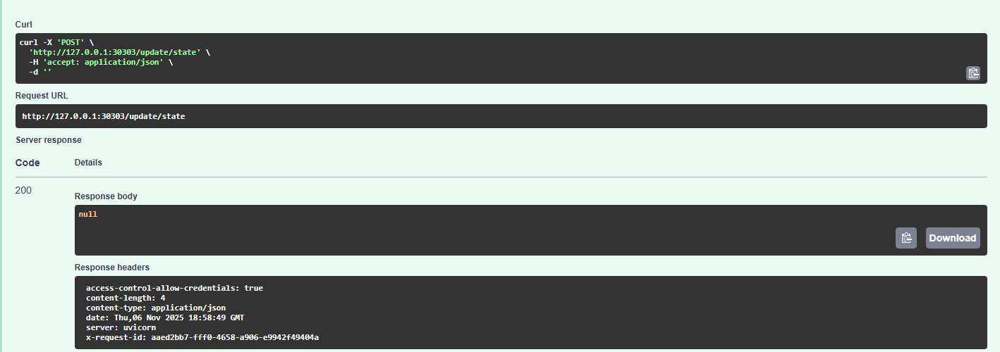

**Logs**
```text
[06/Nov/2025:21:57:12.044 +0300] [request_logging.py:46       ] [DEBUG   ] [a1629524-5d36-4c34-8aea-3a12c7f63737] "Request is processed." ResponseToClient(status=200, headers='{"content-length": "4", "content-type": "application/json", "x-request-id": "a1629524-5d36-4c34-8aea-3a12c7f63737"}', body='')
[06/Nov/2025:21:57:20.158 +0300] [app.py:208                  ] [DEBUG   ] [                                    ] "Greenhouse 1: state unchanged (0)" 
[06/Nov/2025:21:57:20.160 +0300] [app.py:25                   ] [DEBUG   ] [                                    ] "Started getting greenhouse state info." 
[06/Nov/2025:21:57:30.485 +0300] [app.py:225                  ] [INFO    ] [                                    ] "Greenhouse 3: state changed 0 → 1" 
[06/Nov/2025:21:58:49.720 +0300] [request_logging.py:72       ] [DEBUG   ] [                                    ] "Request is received." RequestFromClient(method='POST', endpoint='http://127.0.0.1:30303/update/state', headers='{"host": "127.0.0.1:30303", "connection": "keep-alive", "content-length": "0", "authorization": "Basic SXZhbjoxMjM0", "sec-ch-ua-platform": "\\"Windows\\"", "user-agent": "Mozilla/5.0 (Windows NT 10.0; Win64; x64) AppleWebKit/537.36 (KHTML, like Gecko) Chrome/141.0.0.0 Safari/537.36", "accept": "application/json", "sec-ch-ua": "\\"Google Chrome\\";v=\\"141\\", \\"Not?A_Brand\\";v=\\"8\\", \\"Chromium\\";v=\\"141\\"", "sec-ch-ua-mobile": "?0", "origin": "http://127.0.0.1:30303", "sec-fetch-site": "same-origin", "sec-fetch-mode": "cors", "sec-fetch-dest": "empty", "referer": "http://127.0.0.1:30303/docs", "accept-encoding": "gzip, deflate, br, zstd", "accept-language": "ru-RU,ru;q=0.9,en-US;q=0.8,en;q=0.7"}', body='', client_ip='127.0.0.1')
[06/Nov/2025:21:58:49.726 +0300] [app.py:137                  ] [DEBUG   ] [aaed2bb7-fff0-4658-a906-e9942f49404a] "Starting new status update iteration..." 
[06/Nov/2025:21:58:49.729 +0300] [app.py:25                   ] [DEBUG   ] [aaed2bb7-fff0-4658-a906-e9942f49404a] "Started getting greenhouse state info." 
[06/Nov/2025:21:58:59.998 +0300] [app.py:208                  ] [DEBUG   ] [aaed2bb7-fff0-4658-a906-e9942f49404a] "Greenhouse 2: state unchanged (0)" 
[06/Nov/2025:21:59:00.000 +0300] [app.py:25                   ] [DEBUG   ] [aaed2bb7-fff0-4658-a906-e9942f49404a] "Started getting greenhouse state info." 
[06/Nov/2025:21:59:10.275 +0300] [app.py:225                  ] [INFO    ] [aaed2bb7-fff0-4658-a906-e9942f49404a] "Greenhouse 1: state changed 0 → 1" 
[06/Nov/2025:21:59:10.278 +0300] [app.py:25                   ] [DEBUG   ] [aaed2bb7-fff0-4658-a906-e9942f49404a] "Started getting greenhouse state info." 
[06/Nov/2025:21:59:20.539 +0300] [app.py:208                  ] [DEBUG   ] [aaed2bb7-fff0-4658-a906-e9942f49404a] "Greenhouse 3: state unchanged (1)" 
```

### Ручная корректировка отдельного измерения 

Корректировка состоит из 2-х этапов:

1) Получение списка измерений (с учетом пагинации)

**Screenshots**:

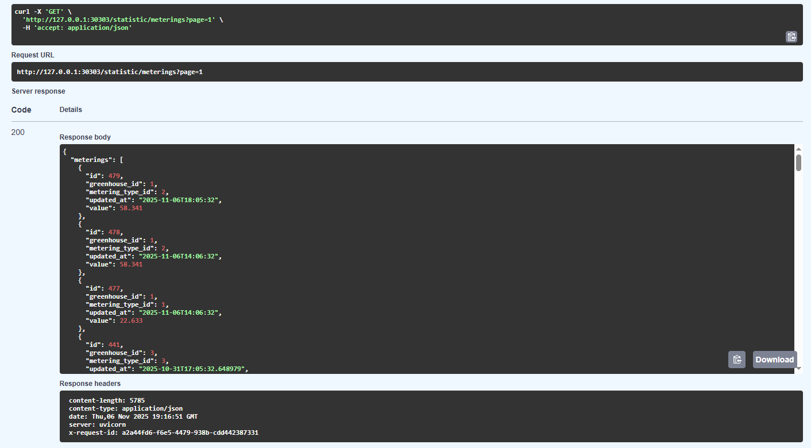

**Logs**:

```text
[06/Nov/2025:22:16:52.031 +0300] [request_logging.py:72       ] [DEBUG   ] [                                    ] "Request is received." RequestFromClient(method='GET', endpoint='http://127.0.0.1:30303/statistic/meterings?page=1', headers='{"host": "127.0.0.1:30303", "connection": "keep-alive", "authorization": "Basic SXZhbjoxMjM0", "sec-ch-ua-platform": "\\"Windows\\"", "user-agent": "Mozilla/5.0 (Windows NT 10.0; Win64; x64) AppleWebKit/537.36 (KHTML, like Gecko) Chrome/141.0.0.0 Safari/537.36", "accept": "application/json", "sec-ch-ua": "\\"Google Chrome\\";v=\\"141\\", \\"Not?A_Brand\\";v=\\"8\\", \\"Chromium\\";v=\\"141\\"", "sec-ch-ua-mobile": "?0", "sec-fetch-site": "same-origin", "sec-fetch-mode": "cors", "sec-fetch-dest": "empty", "referer": "http://127.0.0.1:30303/docs", "accept-encoding": "gzip, deflate, br, zstd", "accept-language": "ru-RU,ru;q=0.9,en-US;q=0.8,en;q=0.7"}', body='', client_ip='127.0.0.1')
[06/Nov/2025:22:16:52.033 +0300] [app.py:71                   ] [DEBUG   ] [a2a44fd6-f6e5-4479-938b-cdd442387331] "Started getting meterings list." 
[06/Nov/2025:22:16:52.037 +0300] [app.py:89                   ] [DEBUG   ] [a2a44fd6-f6e5-4479-938b-cdd442387331] "Page 1/9 successfully received." 
[06/Nov/2025:22:16:52.038 +0300] [request_logging.py:46       ] [DEBUG   ] [a2a44fd6-f6e5-4479-938b-cdd442387331] "Request is processed." ResponseToClient(status=200, headers='{"content-length": "5785", "content-type": "application/json", "x-request-id": "a2a44fd6-f6e5-4479-938b-cdd442387331"}', body='')

```

2) Корректировка конкретного измерения 

**Screenshots**

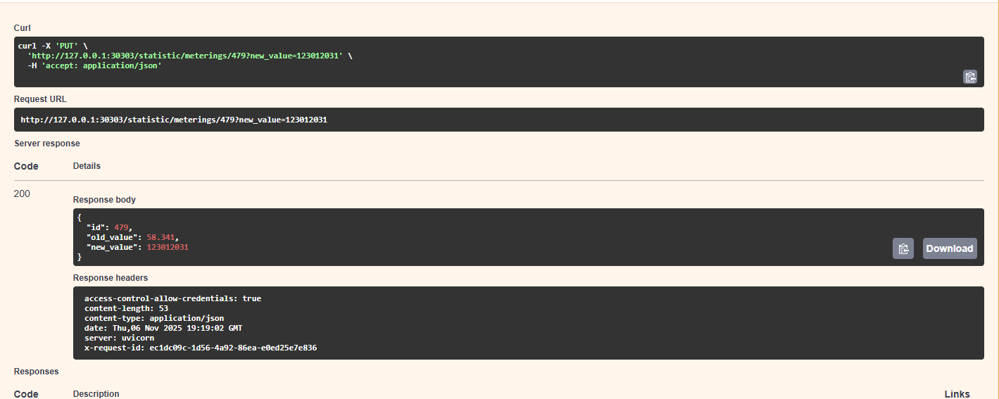

**Logs**

```text
[06/Nov/2025:22:19:03.235 +0300] [app.py:107                  ] [DEBUG   ] [ec1dc09c-1d56-4a92-86ea-e0ed25e7e836] "Started updating metering #479 with new value 123012031.0." 
[06/Nov/2025:22:19:03.239 +0300] [app.py:131                  ] [INFO    ] [ec1dc09c-1d56-4a92-86ea-e0ed25e7e836] "Metering #479 updated from 58.341 to 123012031.0." 
[06/Nov/2025:22:19:03.240 +0300] [request_logging.py:46       ] [DEBUG   ] [ec1dc09c-1d56-4a92-86ea-e0ed25e7e836] "Request is processed." ResponseToClient(status=200, headers='{"content-length": "53", "content-type": "application/json", "x-request-id": "ec1dc09c-1d56-4a92-86ea-e0ed25e7e836"}', body='')
```


### Аутентификация 

**Screenshots**


**Logs**

```text
[06/Nov/2025:13:48:04.529 +0300] [request_logging.py:46       ] [DEBUG   ] [94791025-9079-4dd8-afe5-574665f77163] "Request is processed." ResponseToClient(status=401, headers='{"www-authenticate": "Basic", "content-length": "52", "content-type": "application/json", "x-request-id": "94791025-9079-4dd8-afe5-574665f77163"}', body='{"detail":"Invalid or missing Basic authentication"}')
[06/Nov/2025:13:48:29.816 +0300] [request_logging.py:72       ] [DEBUG   ] [                                    ] "Request is received." RequestFromClient(method='GET', endpoint='http://localhost:30303/statistic?state=0', headers='{"host": "localhost:30303", "connection": "keep-alive", "authorization": "Basic SXZhbjoxMjM0", "sec-ch-ua": "\\"Not.A/Brand\\";v=\\"8\\", \\"Chromium\\";v=\\"114\\"", "accept": "application/json", "sec-ch-ua-mobile": "?0", "user-agent": "Mozilla/5.0 (Windows NT 10.0; Win64; x64) AppleWebKit/537.36 (KHTML, like Gecko) Chrome/114.0.0.0 Safari/537.36", "sec-ch-ua-platform": "\\"Windows\\"", "sec-fetch-site": "same-origin", "sec-fetch-mode": "cors", "sec-fetch-dest": "empty", "referer": "http://localhost:30303/docs", "accept-encoding": "gzip, deflate, br", "accept-language": "ru-RU,ru;q=0.9,en-US;q=0.8,en;q=0.7"}', body='', client_ip='127.0.0.1')
[06/Nov/2025:13:48:29.823 +0300] [app.py:66                   ] [DEBUG   ] [5639af79-2d32-44fb-b47f-2c8d0143d983] "Loaded 3 greenhouses (region_id=None, state=0)" 
[06/Nov/2025:13:48:29.823 +0300] [request_logging.py:46       ] [DEBUG   ] [5639af79-2d32-44fb-b47f-2c8d0143d983] "Request is processed." ResponseToClient(status=200, headers='{"content-length": "355", "content-type": "application/json", "x-request-id": "5639af79-2d32-44fb-b47f-2c8d0143d983"}', body='')
```


## Идеи по улучшению 

### Идеи по улучшению обремененные легаси

Основная концепция улучшения состоит в разгрузке требуемого сервиса "Контроль".
Совершенно очевидно становится, что сервис, являющий одновременно и интерфейсом для пользователя, и своеобразным демоном, который поддерживает корректное обновление данных,
становится

1) Трудно-масштабируемым
2) Сложно-поддерживаемым
3) Сложен в мониторинге и баг-расследованиях (из-за смешения логов в т.ч.)

Предлагается разбить сервис "Контроль" на 2 составляющие: контроль-интерфейс и контроль-бекграунд. 

Общение с сервисом "Greenhouse" возможно оптимизировать с помощью дополнительной утилиты - Debezium. 
Это одно из качественных решений в ситуациях, требующих планировщика/интервального обновления, которые использует хранилище другого микросервиса.
Безусловно, узкое место всей системы - HTTP общение с сервисом оценки, которое является ненадежным и ресурсозатратным.

Также данной системе полезно реализовать сбор метрик, схемы вроде Elastic.

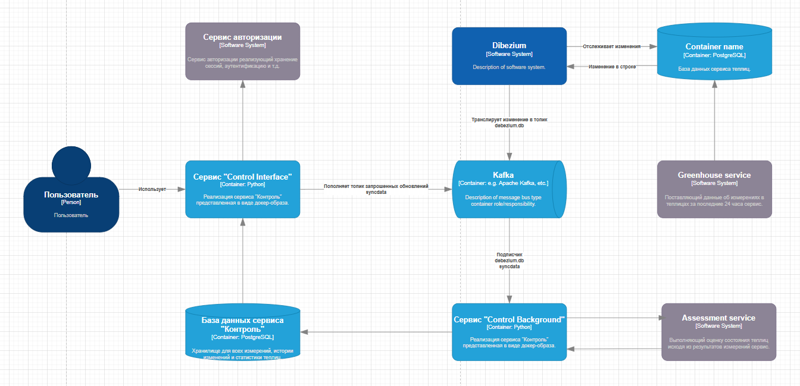


### Идеальная система с переработкой легаси 

У данной системы (без учета разбиения сервиса "Контроль", исправленного в предудыщем пункте) есть самое узкое место - зависимость от внешних сервисов.
В контексте данного проекта предлагаемая "идеальная переработка" с точки зрения автора даже выгоднее остальных способов. 

Предлагается: заменить REST интерфейсы внешних сервисы на общение через Kafka. Тогда:

1) Интервальное обновление становится совсем банальным и надежным: Greenhouse сервис является продюсером, куда поставляет новые данные, а Control-Backgorund слушателем. 
2) Оценка состояния становится надежной благодаря общению через брокера. Гарантируется надежность, консистентность и устойчивость сервиса Assessment (за счет контроля слушателей).

Тогда представленная выше схема приобретает следующий вид: 

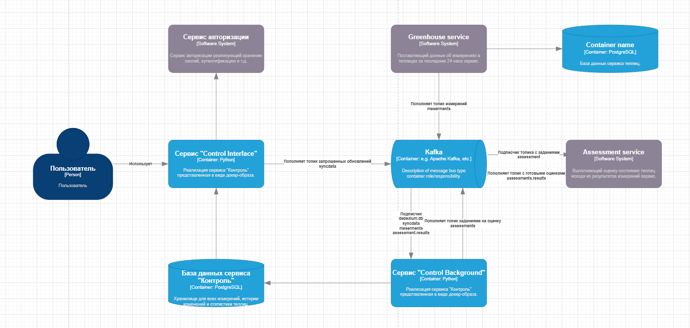

В идеальную систему добавляются экспортеры метрик и читатели логов для анализа. Однако на данном уровне представления иерархии системы (контейнером) это не отображается.


### Улучшения написанного сервиса

Конечно, для полноценной prod реализации не хватает следующих аспектов: 

- Написанных unit/интеграционных тестов. 
- Обработки ошибок (частично зависит от пункта 1). Пример можно встретить [здесь.](./src/infrastructure/greenhouses_service/errors.py)
- Грамотной системы логирования.

Их отсутствие связано с занятостью dev-а (за что я прошу меня извинить).

